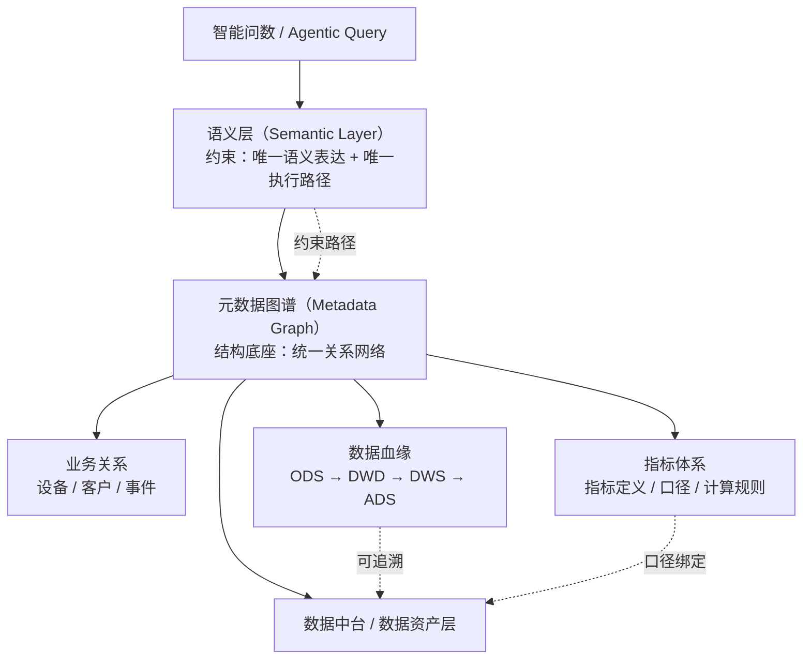
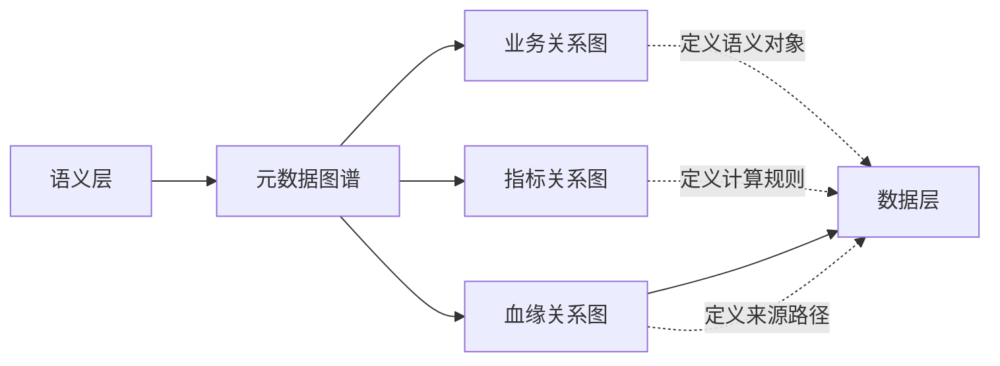
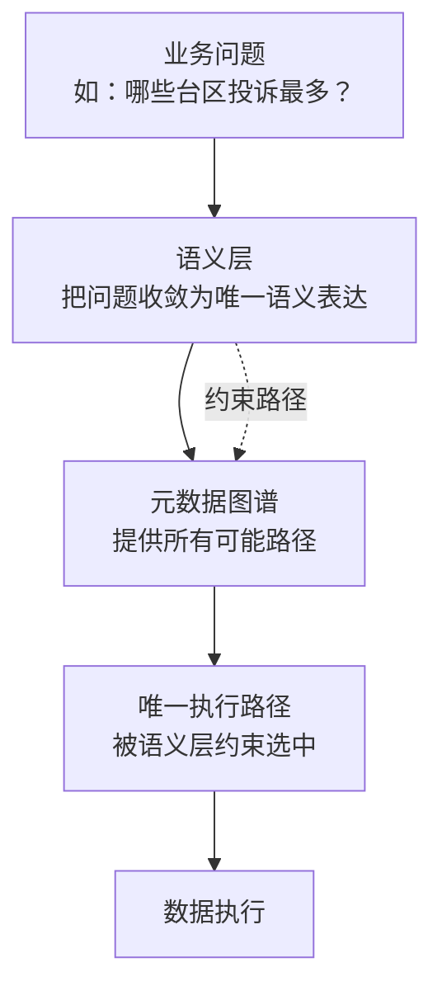

# **语义层：让数据"唯一可解释"**

**电网企业数据中台AI Ready系列之一**

---

设想这个场景：省公司经营分析会快结束了，分管生产的副总突然问了一句："过去一个月，全网10kV线路停电了多长时间？"

数据团队连夜奋战，三天后交出三份数：

- **调度侧**（基于SCADA停电事件与故障录波）：**142万设备停电小时**
- **配网运检侧**（基于PMS缺陷与检修工单）：**128万设备检修停电小时**
- **营销侧**（基于95598工单与停电时户数统计）：**156万客户停电小时**

三个数字，差了20%以上。哪份都没错——但没有一份能直接回答最初那个问题。

问题就出在"停电时长"这四个字上——三个人问的压根不是同一件事：

- 调度问的是"线路停电了多少小时"（设备视角）
- 运检问的是"设备停电检修了多少小时"（运维视角）
- 营销问的是"客户感受到停电了多少小时"（服务视角）

**同一场停电，在三个系统里被拆成了三个不同事件，统计口径完全不同。** 表面上是"数据打架"，根子上是语义层缺失。

这不是数据质量问题，而是典型的"语义层缺失"问题——同一个业务概念，在三个业务域里有三种合法但不可比的定义路径。

---

在电网数据中台里，类似的语义冲突远不止"停电时长"一个。下面三个案例各有代表性，基本涵盖了最常见的三类：

| 类型 | 典型问题 | 冲突本质 |
|------|---------|---------|
| **设备类语义冲突** | "本月配变停电时长是多少？" | 同一设备，多种统计视角（铭牌容量/调度可调容量/台区供电容量） |
| **指标类语义冲突** | "全网供电可靠率是多少？" | 同一指标，多种口径体系（线路可用率/客户平均可靠率/监管剔除口径） |
| **事件类语义冲突** | "今天停电事件有多少？" | 同一定义，多种记录方式（调度跳闸次数/PMS工单数/95598来电数，三个数据源各自独立统计） |

---

## 为什么"听懂"不等于"理解"

过去几年，电网企业投入大量资源做数据治理：主数据管理、元数据采集、数据质量规则……成绩是显著的，数据目录从几百项扩充到几千项，数据资产账从纸质台账变成了线上看板。

但有一个根深蒂固的问题始终没有解决：**数据"听得懂"业务语言，但"不理解"业务语义。**

"听得懂"和"理解"有什么区别？

"听得懂"，是知道"售电量"这三个字对应哪个字段、哪张表。数据中台里查一下元数据，大概率能找到。

"理解"，是知道"售电量"在不同业务域里可能有三套口径——营销结算口径（已发行电量）、调度运行口径（发电侧上网电量）、发展统计口径（省公司范围内直供电量）。更进一步的，是知道这三个口径的差异来源是统计边界不同，而不是数据错误；是知道如果要回答"本月售电量是多少"，首先需要问清楚是哪个业务域的售电量。

没有语义层，数据中台只能回答"听得懂"的问题。真正需要业务判断的问题——"为什么两个系统出来的数字差10%"——依然需要人工介入。

---

## 语义层：数据中台的"双向翻译官"

要回答上一节的问题，本质上不是“找到数据”，而是“确定语义”。

这要求在业务语言与技术实现之间，引入一层能够约束语义表达与执行路径的中间层——语义层（Semantic Layer）。

语义层并不是新概念。业界已经有一系列实践：例如Looker通过LookML实现语义建模，dbt推动了以Metrics Layer为核心的指标语义体系，Data Fabric等架构也开始强调通过元数据与语义增强实现数据理解与集成。但这些方案大多面向数据分析场景，其语义建模对象以指标与维度为主，本质上仍服务于分析查询，而非语义约束。

而在电网企业中，语义复杂性具有典型的“三高一多”特征：高复杂度（调度、运检、营销多业务域并存）、高耦合（同一对象多重身份）、高约束（强监管口径要求）、多源异构（跨系统事件割裂）。在这样的背景下，通用语义建模框架往往只能解决“指标定义一致性”问题，难以支撑跨域语义统一与查询路径约束等更高阶需求。

因此，电网企业需要的语义层，不只是“语义描述层”，而是一个能够承载业务语义与行业规则的约束系统。

从本质上看：

语义层是一个将业务意图映射为唯一数据执行路径的确定性约束系统。

语义层不生成结果，只定义唯一允许生成结果的路径。

在工程实现上，它通过三类核心组件实现语义约束闭环：

- 业务对象模型（定义语义对象及其关系）
- 业务规则引擎（约束语义计算方式）
- 口径定义库（绑定语义与数据来源）

向上支撑智能问数与AI Agent，向下对接数据中台数据目录，实现业务语义到技术执行路径的确定性映射。

从直观理解上，可以把语义层看作数据中台的“双向翻译官”——既将业务语言翻译为可执行的数据路径，也将数据结果还原为业务语义。

**一句话：语义层将"业务语义"收敛为"唯一允许执行的路径"。**

---

## 语义层的本质不是"描述"，而是"约束"

语义层的核心价值，不在于补充业务解释，而在于对数据使用施加约束。

在没有语义约束的情况下，同一个业务问题，可以写出无数种SQL；同一个指标，可以跑出多个结果；同一个数字，也可能被赋予不同解释。

这种“随便怎么查都对”的现象，本质上正是电网数据中台乱象的根源。

### **语义层要解决的，是“收敛”**

语义层的作用，是把这种“多解问题”，收敛成“唯一解问题”：

- 一个业务问题，只能映射到一种语义表达
- 一个指标，只能绑定一套计算口径和一个数据来源
- 一种语义表达，只能对应一条确定的数据查询路径

换句话说：

同一个问题，在系统里只能有一种查法。

### **语义层消灭的，不是“歧义”，而是“执行歧义”**

语义层并不是让大家理解更一致，而是让系统执行结果必须一致。

没有语义约束时，数据中台允许多种“正确SQL”并存；
 有语义约束后，同一个业务问题，只能走一条路径。

### **和元数据的本质区别**

这是最关键的一点：

- 元数据告诉你：**这个字段是什么**
- 语义层约束你：**这个字段只能怎么用**

两者解决的问题完全不同：

- 元数据解决的是：能不能找到数据
- 语义层解决的是：能不能用对数据

如果没有语义约束，AI Agent很容易变成“随机拼SQL”的过程——看似能跑，但：

- 结果不可解释
- 过程不可复现
- 结果不可审计

在电网这种强监管场景中，这是不可接受的。

### **本质升级：从“数据描述”到“执行约束”**

语义层的本质，不是对元数据的补充，而是一次结构升级：

将“业务元数据”，升级为“可执行的约束系统”。

传统元数据解决“数据在哪里”，
 语义层解决“数据应该如何被使用”。

而这些约束之所以能够真正落地，前提是：

它们必须被组织成一张可遍历的关系网络，也就是元数据图谱。

### **一句话总结**

电网数据体系中，大量所谓“数据问题”，本质上并不是数据问题。

而是：

**语义没有被建模，更没有被约束的问题。**

------

## **语义表达 = Semantic Query Schema（语义查询结构）**

一个业务问题，必须先被收敛为**结构化语义表达**，才能进入语义层的约束系统。

语义层不认自然语言，只认结构。

本文采用最小语义表达结构，由六个维度构成：

> **<指标> + <对象> + <事件> + <时间> + <范围> + <口径>**

举例说明。"本月10kV线路故障停电时长"这句话，拆解后得到：

| 维度 | 语义表达 |
|------|---------|
| 指标 | 停电时长 |
| 对象 | 10kV线路 |
| 事件 | 故障停电 |
| 时间 | 本月 |
| 范围 | 全网 |
| 口径 | 调度口径（PMS故障工单+SCADA跳闸记录） |

这六个维度缺一不可。**指标**定义"算什么"，**对象**定义"对什么算"，**事件**定义"什么情况下算"，**时间**定义"算哪个时间段"，**范围**定义"算哪些范围"，**口径**定义"用什么数据源和计算规则"。任何一个维度缺失或模糊，语义层都无法给出唯一答案。

反过来看本文开头的那个场景：三个系统给出三个不同数字，本质原因是——**没有人先把这六个维度对齐**。调度侧用的是"设备视角+调度口径"，运检侧用的是"设备视角+运维口径"，营销侧用的是"客户视角+服务口径"。三个系统对"停电时长"这四个字的六维拆解完全不同，自然跑出三个结果。

**如果语义无法被结构化表达，语义层就无法执行约束。** 这六个维度就是语义层的"输入规范"——不符合这个结构的业务问题，不允许进入语义层。语义层不是万能的，它只在语义已被结构化定义的范围内保证唯一性。

---

## 如果没有语义层

语义层的价值，在反面看得更清楚。没有语义约束的数据中台，会系统性地出现三类崩溃：

**第一：同一指标，多SQL版本，无法复现。** "全网供电量"这个指标，在没有语义约束的体系中，可能同时存在十几种SQL写法。没有语义层约束，谁都不知道哪条SQL是"对的"，每次重新查询都面临版本选择问题。

**第二：同一问题，多个结果，无法解释。** "过去一个月全网停电了多久"，调度侧跑出来142万设备·小时，运检侧跑出来128万设备·小时。没有语义层，两者都无法被判定为"错"——因为没有统一口径，就没有裁决依据。

**第三：AI生成结果，不可审计。** 当NL2SQL让AI直接生成SQL时，生成过程对业务团队不可见——无法追溯AI为什么选了这个字段、这条JOIN路径。结果出错时，没有人能说清楚是AI错了、数据错了、还是口径错了。

**没有语义层，AI能力越强，风险越大。** AI擅长生成，但生成需要约束。没有约束的生成，是在加速生产错误。

---

## 语义层四轴模型：设备·客户·事件·指标

> **注**：本节使用"设备""客户"等通俗用语，便于读者快速理解。对标SG-CIM十大主题域，设备语义对应**电网域**（含输配电设备、拓扑连接），客户语义对应**客户域**（含售电服务、用电客户），事件语义跨**电网域**与**客户域**，指标语义则为全体系量化表达[^1]。

电网业务语义庞大复杂，不能平铺着建，需要锚定四个核心语义轴：设备、客户、事件、指标。

四个语义轴本质上构成了电网业务语义的最小完备集合：对象（设备/客户）+ 行为（事件）+ 度量（指标）。

**第一轴：设备语义**

设备是电网最核心的实体资产。一台10kV配电变压器，在PMS里是一条设备台账记录，在调度系统里是纳入SCADA监视的监控对象，在营销系统里是通过台区拓扑供电的用户侧入口。

"这台配变在运容量"在不同语义体系里分别指：设备铭牌额定容量（PMS）、调度可调容量（SCADA）、台区供电用户总装接容量（营销）。三个数字代表不同的业务含义，各自合法，不能直接比大小。

设备语义的建模目标是：**建立设备全生命周期语义视图，打通PMS/调度/营销/财务四域的设备身份，消灭"同名不同物"和"同物不同名"。**

**第二轴：客户语义**

"客户"在电网不是一个单一概念。售电侧有终端用电客户（居民/工商业），输电侧有电网企业作为市场主体，供电可靠性分析里还有"重要客户"（医院/政府/铁路）。同一自然人，可能同时是"居民客户""大工业客户""光伏发电客户"——三种身份对应三套计量点、三套结算规则。

客户语义的建模目标是：**建立统一客户视图，打通营销域客户档案与设备域供电关系，支持"一个客户"的多身份聚合分析。**

**第三轴：事件语义**

电网每天产生大量"事件"：设备故障跳闸、计划停电、95598来电、计量异常告警、线上业务工单。

"停电"这个词，在调度语境里是"保护动作导致线路失电"，在营销语境里是"对外停电公告"，在客服语境里是"95598话务涌入"。三者相关但不重叠。

事件语义的建模目标是：**统一事件分类标准，建立事件→设备→客户三层溯源这条，支持跨域事件联动分析。**

**第四轴：指标语义**

指标是语义层价值最直接的体现。"供电可靠率"是最典型的例子：调度侧可以统计"所有10kV馈线年平均停电时间"，营销侧可以统计"供电服务范围内客户年平均停电时间"，两者分母不同（线路总长度 vs 客户总数），结果差了不止一个数量级。

指标语义的建模目标是：**建立全公司指标定义库，每个指标附带完整口径文档、业务owner、数据来源和质量规则，支持指标的自动溯源和智能问数。**

四个语义轴不是孤立的：设备语义和客户语义通过"供电关系"互联（哪台设备给哪些客户供电）；事件语义同时关联设备状态变化和客户感知（同一停电事件在设备侧是一条跳闸记录，在客户侧是一通95598来电）；指标语义则是对上述三类语义活动的量化表达（如停电时户数，由设备停电范围与供电关系推导得到）。四轴构成电网业务语义的最小完备集合，彼此支撑，缺一不可。

语义轴要真正落地，需要明确每轴的业务owner——设备语义的owner通常是**设备部/配网运检中心**，负责PMS/调度系统设备模型的统一；客户语义的owner是**营销部**，负责客户档案和计量点的标准化；事件语义的owner往往是**调度中心或安全监察部**，负责统一事件分类标准；指标语义的owner则是**发展部或数字化部**，负责全公司指标定义库的建设和维护。没有明确的业务owner，语义轴就只是技术团队的"自嗨"，业务部门不会认账。

---

## 语义到数据的映射：语义映射层才是关键

语义层建好了，怎么让AI能够自动把"语义请求"翻译成数据查询？

行业里最常见的技术路线是 **NL2SQL（自然语言转SQL）**：用户用自然语言提问，模型生成SQL并在数据库中执行查询。这一路线在互联网数据分析场景中已经被广泛验证，核心前提是——语义已经在数据模型中被相对稳定地定义。

但在电网场景中，这个前提并不成立。

电网的关键问题不是“不会写SQL”，而是“语义在进入SQL之前就没有唯一形态”。同一句话，例如：

“统计本月10kV线路的故障停电时间”

在进入NL2SQL之前，实际上已经包含多层未决语义问题：

- 故障停电事件应来自哪个系统？PMS工单、调度日志还是SCADA事件？
- 停电时长如何定义？是保护动作到恢复供电，还是工单开始到结束？
- 10kV线路的对象映射关系是什么？馈线、设备台账还是拓扑路径？
- 时间口径按自然月还是生产统计周期？

这些问题本质上不属于SQL生成问题，而属于**语义决策问题**。

因此，NL2SQL的能力边界在于：

它可以解决“如何生成查询”，但前提是“查询所依赖的语义已经被确定”。

在电网这种多系统、多口径、多语义共存的环境下，问题的关键顺序发生了反转：

不是“先有语义再生成SQL”，而是“语义本身必须先被结构化和约束”。

因此，NL2SQL更多解决的是**执行层映射问题（Execution Mapping）**，而电网场景真正缺失的是**语义层决策问题（Semantic Resolution）**。

真正有效的技术路径是**语义映射层**（Semantic Mapping Layer）——把语义层的业务对象、指标、口径，对应到物理数据层的表、字段、ETL任务。这条路在数据工程领域已经有一套相对成熟的实践：

- dbt MetricFlow：2025年10月完全开源（Apache 2.0），由 dbt Labs、Snowflake、Salesforce 共同维护，并成为 OSI 规范草案的参考实现之一。它不仅是 YAML 定义工具，更是完整的语义编译引擎——通过 semantic model 构建、join 路径解析、SQL 生成，实现跨数据源的指标一致性计算。
- Cube Agentic Analytics：2025年10月 GA 后统一品牌，已从"API 执行层"演进为语义建模 + AI Agent + 多协议集成的综合语义平台。支持自然语言辅助建模、LookML 迁移、多 Agent 协作，以及 MCP/A2A 协议嵌入外部 AI 工作流。
- Looker LookML：通过 LookML 构建语义模型（Views / Explores / Joins），驱动 SQL 自动生成，是业界历史最久的语义建模实践之一。2025 年推出 Looker Modeler 尝试解耦生态，但 Gemini 集成细节主要来自第三方观察，官方技术文档披露有限。

阿里 DataWorks OneData 是阿里云生态内的指标资产管理平台，原子/派生/复合三层体系在官方文档中有描述，但与 OSI 标准或主流开源语义引擎的公开互操作文档不足，不纳入跨工具技术对比。其在阿里云存量用户场景中有一定适用性，但跨域语义约束能力弱。

对电网企业来说，参考dbt MetricFlow的思路自建语义映射层是更务实的选择：不需要推翻现有数据中台，而是在数据中台之上叠一层语义抽象，把业务元数据（指标定义、口径规则、业务对象关系）从ETL代码和数据模型中抽离出来，单独管理。但需要注意，dbt等工具提供的是通用语义建模框架，电网语义复杂度远高于通用分析场景——同一物理设备在PMS/调度/营销/财务四域有四套身份，这里的"四套身份"不只是编码差异，而是业务语义的本质分歧——调度看设备是"可监控对象"，财务看设备是"折旧单元"，两个语义身份背后的计算口径完全不同。同一业务事件在四个系统有四种记录方式——需要在通用框架基础上扩展行业语义体系，才能真正支撑电网级的语义约束要求。

语义规则本身并不具备执行能力，只有当语义被映射到结构化关系网络中，才能被AI稳定调用。这种结构在工程上对应的不是单一模型，而是一张**元数据图谱**（Metadata Graph）。

这张图谱至少包含三类核心关系：

- **业务关系**（对象—对象）：设备—供电客户、客户—合同、设备—拓扑
- **指标关系**（指标—指标）：线损率 → 线损电量 / 供电量
- **血缘关系**（表—表 / 字段—字段）：ODS → DWD → ADS

语义层并不存储这些关系，而是在这张图上定义"唯一可走路径"。血缘解决"数据怎么来的"，但不解决"路径怎么走"。语义层的执行路径，本质上是建立在元数据图谱之上的多跳关系路径，而血缘只是其中的一类关系。

血缘不是语义层的基础组件，而是元数据图谱中的一种关系类型。

下一篇将聚焦元数据图谱的构建，解答这张"关系结构"网络如何把语义层的三类关系组织为可遍历的结构，从而让语义层的约束真正落地。

---

## 真正的答案不是NL2SQL，是Agentic Query

NL2SQL解决的是"人问机器答"的问题。但在AI Ready的数据中台里，核心交互模式正在从"人问机器答"转向"机器帮人决策"。

**Agentic Query**（智能体驱动的语义查询）代表了一种新的范式：不是让AI去猜用户想要什么，而是**让AI基于语义层理解业务上下文，自己编排查询路径，把多源数据串起来，给出带业务语义的答案。**

举个例子，用户问："这个月高损失台区治理有没有效果？"

Agentic Query的处理过程大概是：
1. 拆解"高损失台区"——对应线损率超过阈值的台区，涉及设备域（配变台账）和营销域（供电关系）
2. 查"治理效果"——对比本月和上月线损率变化，涉及指标语义（线损率=线损电量/供电量）和数据血缘（哪张表算的）
3. 对上"治理措施"——找到同期降损改造的项目台账，涉及事件语义（改造投运记录）
4. 综合分析——把设备改造和线损变化关联起来，给出因果判断

这就不是一条SQL能搞定的事了，涉及多个业务域、多个指标、多条血缘这条。语义层在这里充当"业务大脑"：AI Agent不直接查数据库，而是通过语义层理解业务语义、编排查询、整合跨域结果。

这正是本系列导言中提出的"AI Ready四步闭环"中**"语义可解析"**的核心要求：没有语义层，AI Agent就缺少业务上下文，无法做可靠的查询编排和多源融合。

语义层的完备性决定了AI的可靠性——语义层必须足够完整，才能把AI约束在"唯一解路径"之内。

这里有一个**反直觉约束**需要明确：**Agent不允许生成SQL，只允许选择语义层已经定义好的路径。** 这是语义层和NL2SQL的根本区别——NL2SQL让AI"猜"SQL，语义层让AI"选"路径。AI的能力不是"生成能力"，而是"路径选择能力"。生成能力归语义层，AI只负责在语义层定义的有限路径中做出最优选择。没有这条约束，AI生成的SQL无法被解释、无法被审计、无法被信任。这条约束成立的前提是：语义层已经定义了完备的路径集合。如果某个业务问题在语义层中没有对应路径，系统应返回"语义不完整"而非交给 Agent 自行生成 SQL。

---

## 语义层在AI Ready体系中的位置

回到本系列导言提出的AI Ready框架。语义层不是孤立的组件，它与元数据图谱一起构成电网数据中台的AI Ready能力底座。以下三张图，分别从整体架构、结构拆解和核心论点三个维度，诠释语义层在AI Ready体系中的位置与约束关系。

**图一：AI Ready体系总体架构**

语义层上接智能问数与Agent应用，下接元数据图谱作为结构底座。图谱内部包含三类关系——业务关系、指标体系、数据血缘——分别约束语义对象的定义、计算口径与数据来源。虚线箭头表示约束关系：语义层约束图谱中的路径选择，指标体系绑定计算口径，数据血缘保障来源可追溯。

---

**图二：语义层 vs 元数据图谱 vs 三类关系**

语义层不直接操作数据，而是作用于元数据图谱。图谱中的血缘关系定义"数据从哪张表来"，指标关系定义"指标怎么算"，业务关系定义"业务对象是什么"。三层关系各司其职，共同支撑语义层的可执行性。

---

**图三：语义层的核心约束逻辑**

这是语义层区别于传统元数据管理的关键所在：语义层不仅"理解"业务问题，更在元数据图谱的众多可能路径中，约束出唯一允许执行的那条。路径对不对，不取决于AI能力，而取决于语义层够不够完整。

---

简单说就是三句话：

- **元数据图谱**：告诉我们"有哪些路可以走"
- **语义层**：告诉我们"只能走哪条路"
- **血缘与指标**：分别管住"数据从哪来"和"数字怎么算"

**AI Ready中台的核心公式：**

> **传统数据中台 = 数据 + 指标 + 报表**
>
> **AI Ready中台 = 数据 + 语义 + 图谱 + Agent**

没有语义，数据就是散点；没有图谱，语义就是空话；没有Agent，语义层就是静态词典。三者叠加，数据中台才从"可以查"进化到"可以信任"。

没有业务对象模型，语义层就是空架子；没有指标定义库，连"售电量是多少"这种简单问题AI都答不准；没有数据血缘层，AI根本不知道这个数字是从哪张表查出来的。

语义层是整个体系的"中枢"——上接业务对象，下接数据血缘，左连指标定义，右接AI引擎。

语义层在这里扮演的是**"查询编排中枢"**的角色。它不直接出数据结果，而是负责生成"查询路径定义"——输出的不是SQL，而是"这个意图该按什么路径查"。这条路径底层以元数据图谱的形式存在，靠业务关系、指标关系和血缘关系三类边构成，血缘和指标定义保证可追溯、可解释。真正去查数据的，是下层的数据服务。

以前的数据中台，查询路径是藏在SQL里的；语义驱动的体系里，查询路径变成了显式定义的结构，受统一约束。语义层的意义，不是让查询更灵活，而是让查询路径变得唯一、可靠、可解释。

如果说元数据图谱定义了"所有可能的路径"，语义层定义的，就是"唯一允许走的路径"。

---

## 最小落地路径：从理念到第一步

语义层的建设不需要一开始就追求完备。基于本文提出的框架，建议按以下三步切入：

**第一步：收敛指标口径（先统一"指标语义"）。** 从公司最常用的top 20指标开始，为每个指标建立标准口径文档——明确计算公式、数据来源、业务owner。这一步投入最小、见效最快，是整个体系的突破口。

**第二步：统一设备/客户ID（先统一"对象语义"）。** 在指标口径收敛的过程中，识别出跨系统数据无法对齐的根本原因——往往是设备ID或客户ID在营销/PMS/调度三域不统一。这一步需要设备部和营销部主导，但一旦打通，后续所有跨域分析都有了基础。

**第三步：建立语义映射表（先打通"语义→数据"）。** 将已收敛的指标口径，对应到物理数据层的表名字段名，形成语义映射表。这一步是语义层的雏形，也是后续智能问数能力的入口。

三步完成后，语义层的基础骨架已经就位——后续每新增一个指标、一个业务对象，都是在这个骨架上长出来的，而不是重新搭架子。

---

**下一篇预告**：语义层定义清楚了，但"关系结构"本身长什么样？元数据图谱如何构建？本系列第二篇《元数据图谱：语义层的"施工图"》将聚焦图谱建模，解答如何用一张图把语义层的三类关系（业务/指标/血缘）组织为可遍历的结构网络。

语义层建好之后，业务人员用自然语言提问、系统自动解析语义并查询——这就是本系列第四篇将要展开的**"智能问数"**：语义层是它的认知底座，元数据图谱是它的查询路径，两者缺一，智能问数就是空中楼阁。

---

*本文为AI Ready系列第一篇。系列目录：导言《当电网企业数据中台谈AI Ready时，AI真正听到了什么？》/ 第一篇《语义层：让数据可理解》/ 第二篇《元数据图谱：语义层的"施工图"》/ 第三篇《指标体系：终结"数据打架"》/ 第四篇《智能问数：人与数据的第一次自然对话》/ 第五篇《数据质量闭环：让错误从源头无处遁形》*
